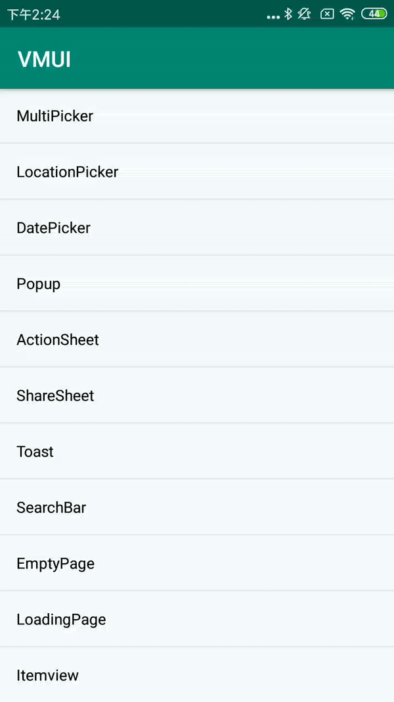

ActionSheet也是使用MultiButtonActionSheetBuilder实现

#### 使用方法

```java
new VActionSheet.MultiButtonActionSheetBuilder(MainActivity.this)
    .setTitle("这是一个清晰的描述，可以为一行也可以为两行，这仅仅是一个清晰的描述")
    .addAction("危险按钮", VDialogAction.ACTION_PROP_DANGER, new VDialogAction.ActionListener() {})
    .addAction("按钮1", VDialogAction.ACTION_PROP_COMMON, new VDialogAction.ActionListener() {})
    .addAction("按钮2", VDialogAction.ACTION_PROP_COMMON, new VDialogAction.ActionListener() {})
    .addAction("主操作", new VDialogAction.ActionListener() {})
    .setActionContainerOrientation(LinearLayout.VERTICAL)
    .showActionSheet();
```

#### 预览

