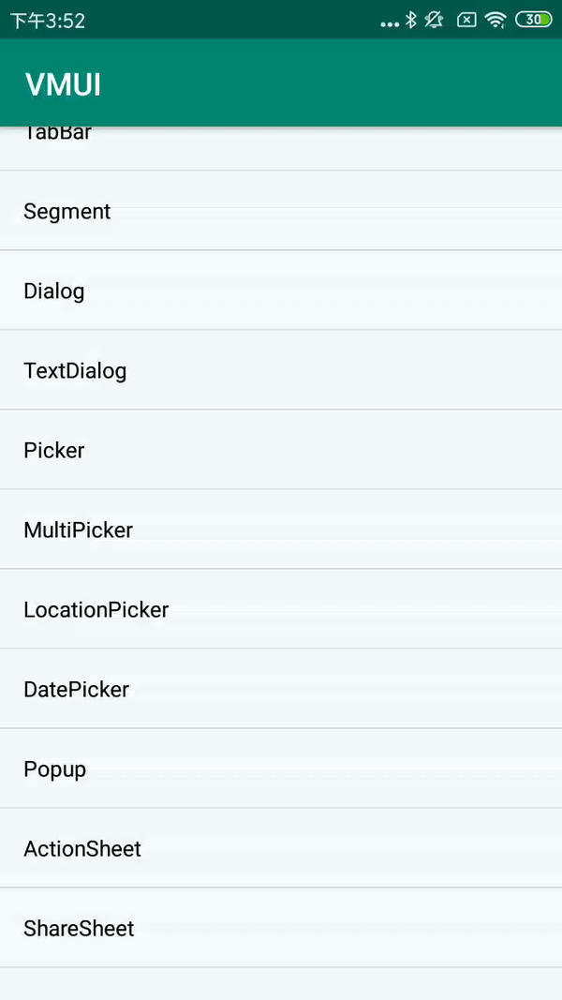

#### MultiCheckableDialogBuilder扩展方法

| Name        | Description    |
| ----------- | -------------- |
| setData     | 设置单选项数据 |
| getSelected | 获取选中项     |

#### 使用方法


```java
List<String> data1 = new ArrayList<>();
data1.add("选项0");
data1.add("选项1");
data1.add("选项2");
data1.add("选项3");
data1.add("选项4");
data1.add("选项5");
data1.add("选项6");
data1.add("选项7");
data1.add("选项8");
data1.add("选项9");
VDialog.MultiCheckableDialogBuilder builder4 = new VDialog.MultiCheckableDialogBuilder(MainActivity.this);
builder4.addAction("确认", new VDialogAction.ActionListener() { 
            @Override   
            public void onClick(Dialog dialog, int index) {
                   dialog.dismiss(); 
                   Toast.makeText(MainActivity.this, "您选择的内容是：" + builder4.getSelectContent(),
                   Toast.LENGTH_SHORT).show();
                 }
            })  
.setData(data1)       
.setTitle("弹窗标题")        
.showDialog();
```

