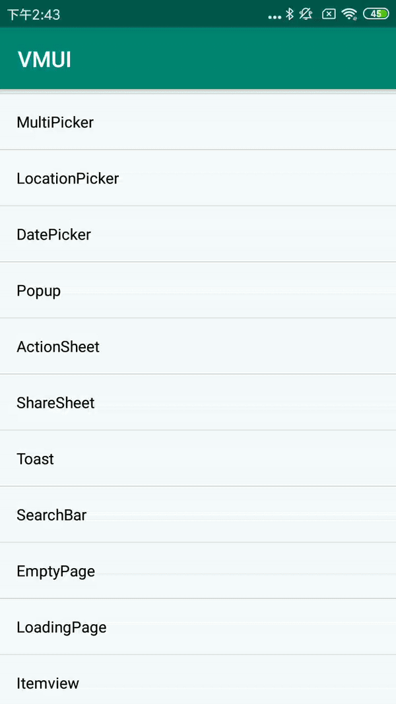

#### VSearchBar属性

| Name                       | Type      | Description        |
| -------------------------- | --------- | ------------------ |
| search_cancel_text         | string    | 取消键的文字       |
| search_cancel_color        | color     | 取消键的文字颜色   |
| search_cancel_textsize     | dimension | 取消键的文字大小   |
| search_text_color          | color     | 输入框的文字颜色   |
| search_textsize            | dimension | 输入框的文字大小   |
| search_hint                | string    | 输入框提示文字     |
| search_hint_color          | color     | 输入框提示文字颜色 |
| search_textcursor_drawable | reference | 输入框光标drawable |

#### OnSearchListner的主要回调方法

| Name          | Description  |
| ------------- | ------------ |
| onTextChanged | 输入文本变化 |
| onCancelClick | 点击取消     |
| onSearchClick | 点击搜索     |

#### 使用方法

```xml
<com.viomi.vmui.VSearchBar    
android:layout_width="match_parent"  
android:layout_height="wrap_content"   
app:search_hint="预设信息"    
app:search_cancel_text="取消"/>
```

```java
searchBar.setListner(new VSearchBar.OnSearchListner() {
    ......
});
```

