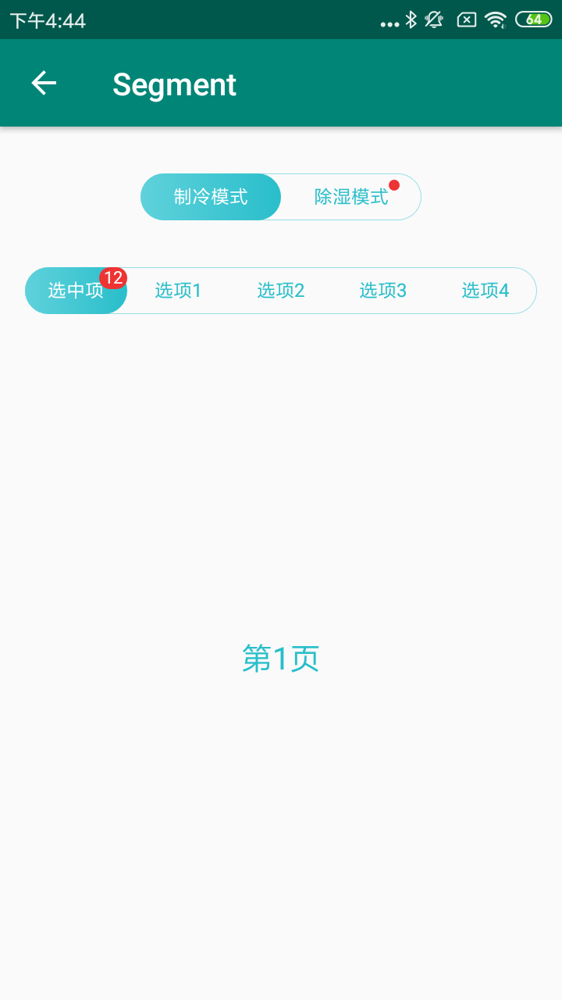

##### 一、固定宽度

```xml
<com.viomi.vmui.VSegment    
 android:id="@+id/tabSegment0"    
 android:layout_width="180dp"    
 android:layout_height="30dp"    
 android:layout_gravity="center_horizontal"    
 android:layout_marginTop="30dp"    
 android:background="@drawable/segment_bg" />
```

```java
VSegment.Tab tab00 = new VSegment.Tab("制冷模式");
VSegment.Tab tab01 = new VSegment.Tab("除湿模式");
tab01.showSignCountView(getBaseContext(), 0);
mTabSegment0.addTab(tab00);
mTabSegment0.addTab(tab01);
mTabSegment0.setDefaultSelectedColor(getResources().getColor(R.color.viomi_green));
mTabSegment0.setDefaultNormalColor(getResources().getColor(R.color.viomi_green));
mTabSegment0.setIndicatorSelectedColor(getResources().getColor(R.color.white));
mTabSegment0.setIndicatorDrawable(getResources().getDrawable(R.drawable.segment_indicator));
mTabSegment0.selectTab(0);
```

##### 二、自适应宽度

```xml
<com.viomi.vmui.VSegment    
android:id="@+id/tabSegment"   
android:layout_width="match_parent"    
android:layout_height="30dp"    
android:layout_gravity="center_horizontal"    
android:layout_marginLeft="16dp"    
android:layout_marginTop="30dp"    
android:layout_marginRight="16dp"   
android:background="@drawable/segment_bg" />
```

```java
VSegment.Tab tab0 = new VSegment.Tab("选项1");
VSegment.Tab tab1 = new VSegment.Tab("选项2");
VSegment.Tab tab2 = new VSegment.Tab("选项3");VSegment.Tab tab3 = new VSegment.Tab("选项4");
mTabSegment.addTab(tab);
mTabSegment.addTab(tab0);
mTabSegment.addTab(tab1);
mTabSegment.addTab(tab2);mTabSegment.addTab(tab3);
mTabSegment.setDefaultSelectedColor(getResources().getColor(R.color.viomi_green));
mTabSegment.setDefaultNormalColor(getResources().getColor(R.color.viomi_green));
mTabSegment.setIndicatorSelectedColor(getResources().getColor(R.color.white));
mTabSegment.setIndicatorDrawable(getResources().getDrawable(R.drawable.segment_indicator));
mContentViewPager.setAdapter(mPagerAdapter);
mContentViewPager.setCurrentItem(0, false);
mTabSegment.setupWithViewPager(mContentViewPager, false);
mTabSegment.addOnTabSelectedListener(new VSegment.OnTabSelectedListener(){});
```

