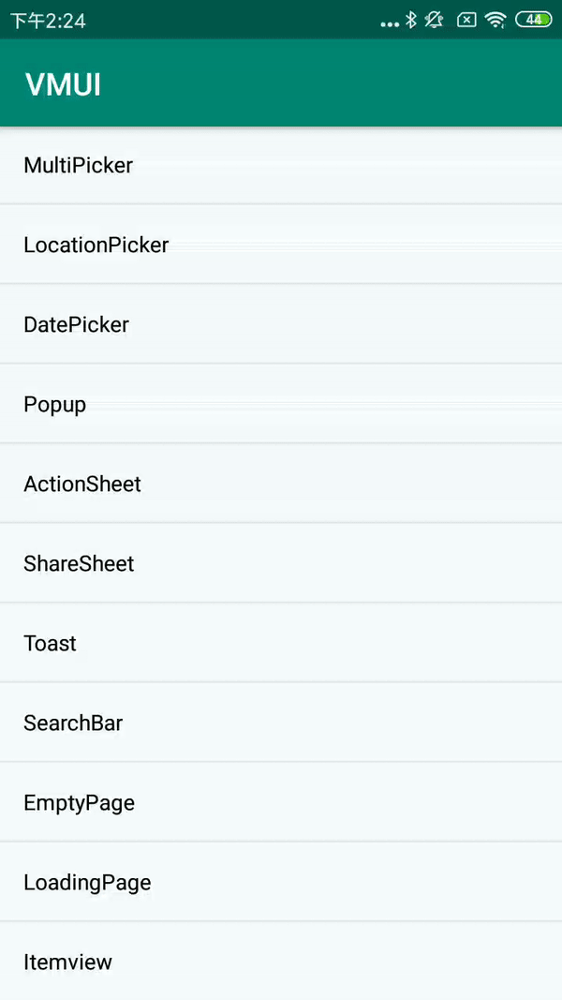

#### ShareSheetDialogBuilder扩展方法
| Name                        | Description      |
| --------------------------- | ---------------- |
| addItem                     | 添加item         |
| setNumColumns               | 设置列数         |
| setOnSheetItemClickListener | 设置item点击回调 |

#### 使用方法

```java
new VActionSheet.ShareSheetDialogBuilder(MainActivity.this)
    .addItem("QQ空间", R.mipmap.ic_launcher)
    .addItem("微信", R.mipmap.ic_launcher)
    .addItem("腾讯微博", R.mipmap.ic_launcher)
    .addItem("新浪微博", R.mipmap.ic_launcher)
    .setOnSheetItemClickListener(new VActionSheet.ShareSheetDialogBuilder.OnSheetItemClickListener() {})
    .showActionSheet();
```

