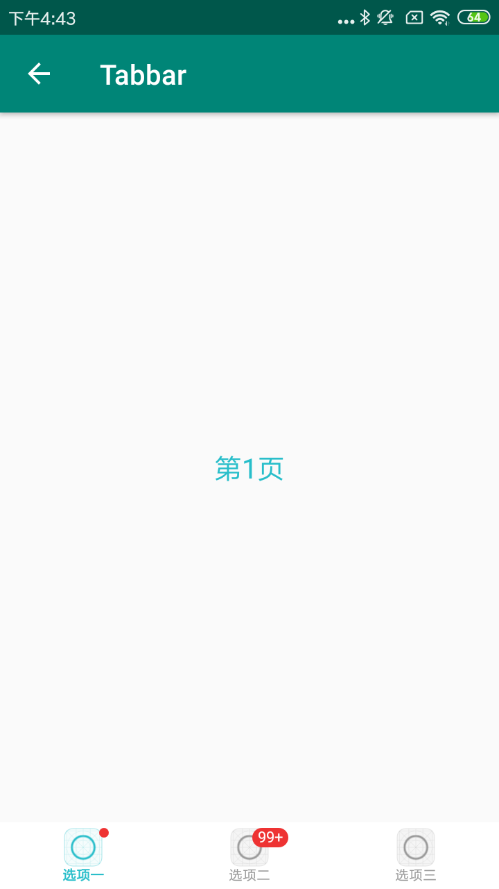

#### 使用方法

```xml
<com.viomi.vmui.VTabSegment   
android:id="@+id/tabSegment"
android:background="@color/white"    
android:layout_width="match_parent" 
android:layout_height="@dimen/tab_height" />
```

```java
Drawable selectedDrawable0 = getResources().getDrawable(R.mipmap.p4);
Drawable normalDrawable0 = getResources().getDrawable(R.mipmap.p41);
Drawable selectedDrawable1 = getResources().getDrawable(R.mipmap.p4);
Drawable normalDrawable1 = getResources().getDrawable(R.mipmap.p41);
Drawable selectedDrawable2 = getResources().getDrawable(R.mipmap.p4);
Drawable normalDrawable2 = getResources().getDrawable(R.mipmap.p41);
VTabSegment.Tab tab0 = new VTabSegment.Tab(normalDrawable0, selectedDrawable0, "选项一", false);
tab0.showSignCountView(getBaseContext(), 0);tab0.setIconPosition(VTabSegment.ICON_POSITION_TOP);
tab0.setTextSize((int) TypedValue.applyDimension(TypedValue.COMPLEX_UNIT_SP,10,getResources().getDisplayMetrics()));
VTabSegment.Tab tab1 = new VTabSegment.Tab(normalDrawable1, selectedDrawable1, "选项二", false);
tab1.showSignCountView(getBaseContext(), 100);
tab1.setIconPosition(VTabSegment.ICON_POSITION_TOP);
tab1.setTextSize((int) TypedValue.applyDimension(TypedValue.COMPLEX_UNIT_SP,10,getResources().getDisplayMetrics()));
VTabSegment.Tab tab2 = new VTabSegment.Tab(normalDrawable2, selectedDrawable2, "选项三", false);
tab2.setIconPosition(VTabSegment.ICON_POSITION_TOP);
tab2.setTextSize((int) TypedValue.applyDimension(TypedValue.COMPLEX_UNIT_SP,10,getResources().getDisplayMetrics()));
mTabSegment.addTab(tab0);mTabSegment.addTab(tab1);
mTabSegment.addTab(tab2);
mTabSegment.setDefaultSelectedColor(getResources().getColor(R.color.viomi_green));
mTabSegment.setDefaultNormalColor(getResources().getColor(R.color.tips_gray));
mTabSegment.setupWithViewPager(mContentViewPager, false);
mTabSegment.setHasIndicator(false);
mTabSegment.setMode(VTabSegment.MODE_FIXED);
mTabSegment.addOnTabSelectedListener(new VTabSegment.OnTabSelectedListener(){});
```

