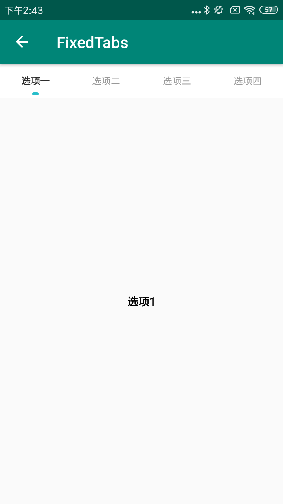
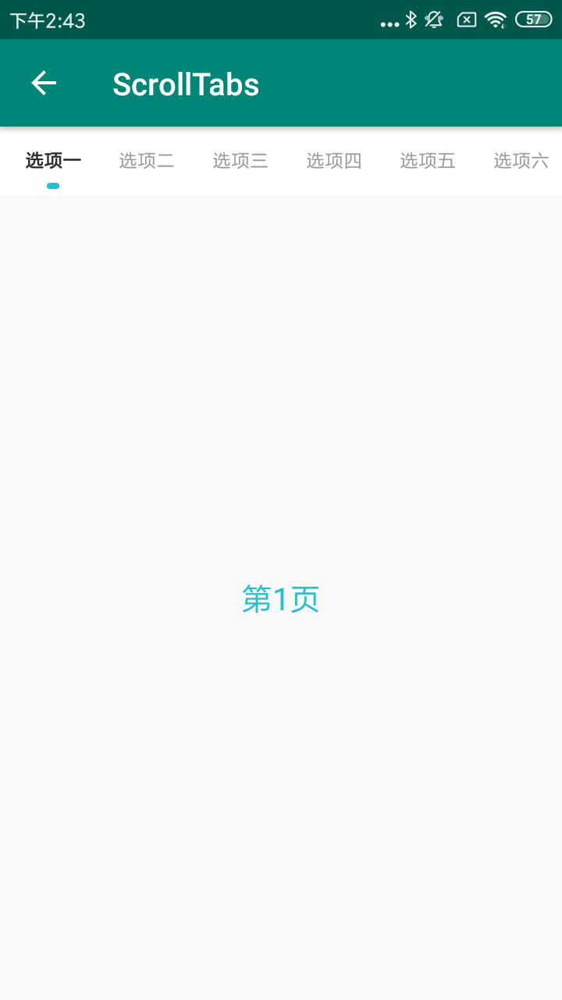
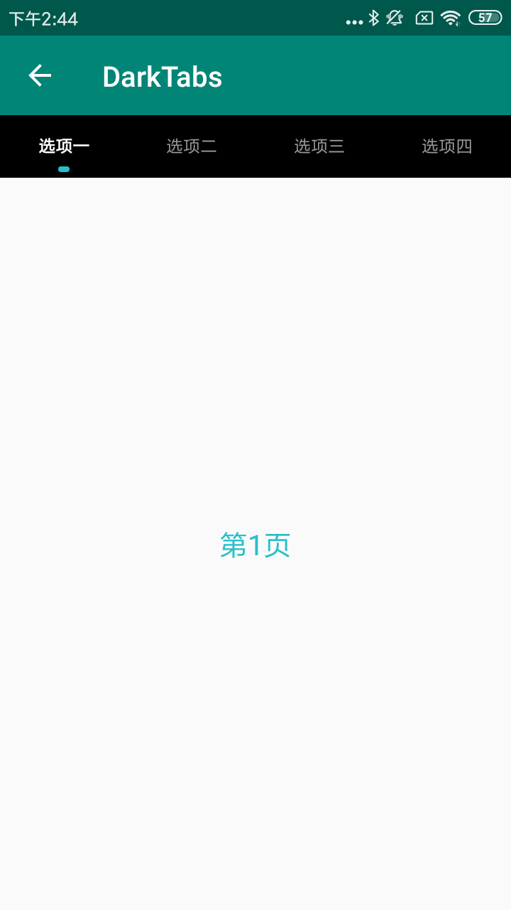
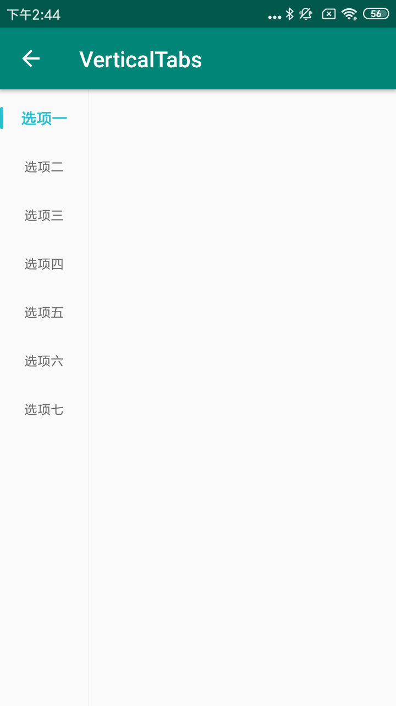

### Segment的主要方法


| Name                           | Description                                      |
| ------------------------------ | ------------------------------------------------ |
| setDefaultNormalColor          | 设置 Tab 一般状态下的颜色                        |
| setDefaultSelectedColor        | 设置 Tab 选中状态下的颜色                        |
| addTab                         | 添加Tab                                          |
| setIndicatorDrawable           | 设置Indicator                                    |
| setupWithViewPager             | 设置与ViewPager联动                              |
| setIndicatorWidthAdjustContent | 设置 indicator的宽度是否随内容宽度变化           |
| setMode                        | 设置模式： MODE_SCROLLABLE滚动，MODE_FIXED自适应 |
| addOnTabSelectedListener       | 添加Tab选中回调                                  |

### Tabs的四种样式用法

#### 一、FixedTabs

#### 使用方法

```xml
<com.viomi.vmui.VTabSegment    
 android:background="#fff"
 android:layout_width="match_parent"
 android:layout_height="@dimen/tab_height" />
```

```java
VTabSegment.Tab tab0 = new VTabSegment.Tab("选项一");
VTabSegment.Tab tab1 = new VTabSegment.Tab("选项二");
mTabSegment.addTab(tab0);
mTabSegment.addTab(tab1);
mTabSegment.addTab(new VTabSegment.Tab("选项三"));
mTabSegment.addTab(new VTabSegment.Tab("选项四"));
mTabSegment.setDefaultSelectedColor(getResources().getColor(R.color.title_gray));
mTabSegment.setDefaultNormalColor(getResources().getColor(R.color.tips_gray));
mTabSegment.setIndicatorDrawable(getResources().getDrawable(R.drawable.indicator));
mTabSegment.setupWithViewPager(mContentViewPager, false);
mTabSegment.setIndicatorWidthAdjustContent(false);
mTabSegment.setMode(VTabSegment.MODE_FIXED);
mTabSegment.addOnTabSelectedListener(new OnTabSelectedListener(){});
```


#### 二、ScrollTabs

#### 使用方法

```xml
<com.viomi.vmui.VTabSegment   
android:background="#fff"   
android:layout_width="match_parent"
android:layout_height="@dimen/tab_height" />
```

```java
VTabSegment.Tab tab0 = new VTabSegment.Tab("选项一");
VTabSegment.Tab tab1 = new VTabSegment.Tab("选项二");
int padding = (int) TypedValue.applyDimension(TypedValue.COMPLEX_UNIT_DIP, 16, getResources().getDisplayMetrics());
mTabSegment.setPadding(padding, 0, padding, 0);
mTabSegment.addTab(tab0);
mTabSegment.addTab(tab1);
mTabSegment.addTab(new VTabSegment.Tab("选项三"));
mTabSegment.addTab(new VTabSegment.Tab("选项四"));
mTabSegment.addTab(new VTabSegment.Tab("选项五"));mTabSegment.addTab(new VTabSegment.Tab("选项六"));
mTabSegment.addTab(new VTabSegment.Tab("选项七"));
mTabSegment.setDefaultSelectedColor(getResources().getColor(R.color.title_gray));
mTabSegment.setDefaultNormalColor(getResources().getColor(R.color.tips_gray));
mTabSegment.setIndicatorDrawable(getResources().getDrawable(R.drawable.indicator));
mTabSegment.setupWithViewPager(mContentViewPager, false);
mTabSegment.setIndicatorWidthAdjustContent(false);
mTabSegment.setMode(VTabSegment.MODE_SCROLLABLE);
mTabSegment.addOnTabSelectedListener(new OnTabSelectedListener(){});
```



#### 三、DarkTabs

#### 使用方法

把背景设置成黑色并设置一般状态和选中状态的字体颜色

```xml
<com.viomi.vmui.VTabSegment
 android:background="#000" 
 android:layout_width="match_parent"
 android:layout_height="@dimen/tab_height" />
```

```java
mTabSegment.setDefaultSelectedColor(getResources().getColor(R.color.white));
mTabSegment.setDefaultNormalColor(Color.parseColor("#99ffffff"));
```



#### 四、VerticalTabs

#### 使用方法

```xml
<com.viomi.vmui.VVerticalTabSegment    
 android:layout_width="@dimen/tab_width"    
 android:layout_height="match_parent"
 app:seg_indicator_width="@dimen/seg_indicator_width" />
```

```java
VVerticalTabSegment.Tab tab0 = new VVerticalTabSegment.Tab("选项一");
VVerticalTabSegment.Tab tab1 = new VVerticalTabSegment.Tab("选项二");
int padding = (int) TypedValue.applyDimension(TypedValue.COMPLEX_UNIT_DIP, 16, getResources().getDisplayMetrics());
mTabSegment.setDefaultSelectedColor(getResources().getColor(R.color.viomi_green));
mTabSegment.setDefaultNormalColor(getResources().getColor(R.color.content_gray_light));
mTabSegment.setIndicatorDrawable(getResources().getDrawable(R.drawable.indicator_ver));
mTabSegment.setPadding(0, padding, 0, padding);
mTabSegment.addTab(tab0);
mTabSegment.addTab(tab1);
mTabSegment.addTab(new VVerticalTabSegment.Tab("选项三"));
mTabSegment.addTab(new VVerticalTabSegment.Tab("选项四"));
mTabSegment.addTab(new VVerticalTabSegment.Tab("选项五"));
mTabSegment.addTab(new VVerticalTabSegment.Tab("选项六"));
mTabSegment.addTab(new VVerticalTabSegment.Tab("选项七"));
mTabSegment.setIndicatorWidthAdjustContent(true);
mTabSegment.setMode(VVerticalTabSegment.MODE_SCROLLABLE);
mTabSegment.selectTab(0);
```

