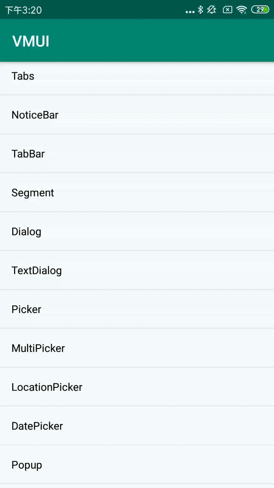

#### EditTextDialogBuilder扩展方法

| Name                    | Description                                          |
| ----------------------- | ---------------------------------------------------- |
| setShowTipsText         | 是否显示提示信息                                     |
| setPlaceholder          | 设置输入框hint                                       |
| setInputType            | 设置输入文本类型                                     |
| setTransformationMethod | 设置密码不可见（new PasswordTransformationMethod()） |


#### 使用方法

```java
VDialog.EditTextDialogBuilder builder = new VDialog.EditTextDialogBuilder(MainActivity.this);
builder.addAction("取消", VDialogAction.ACTION_PROP_NEGATIVE,
   new VDialogAction.ActionListener() {  
     @Override    
    public void onClick(Dialog dialog, int index){dialog.dismiss();    }})
.addAction("确认", VDialogAction.ACTION_PROP_POSITIVE, 
    new VDialogAction.ActionListener() {  
     @Override  public void onClick(Dialog dialog, int index) {
        if (builder.getEditText().getText().toString().isEmpty()) {
        Toast.makeText(MainActivity.this, "请输入您的内容",Toast.LENGTH_SHORT).show(); 
        } else { 
        Toast.makeText(MainActivity.this, "您输入的内容是：" 
        +builder.getEditText().getText().toString(), Toast.LENGTH_SHORT).show();
        }
        dialog.dismiss(); 
      }
    })
.setPlaceholder("在此输入您的内容")
.setTitle("弹窗标题")
.setShowTipsText(true)        
//.setTransformationMethod(new PasswordTransformationMethod())        
.showDialog();
```

