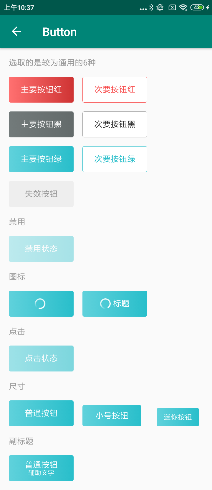

#### 使用方法：

```xml
<com.viomi.vmui.VButton    
 android:layout_width="@dimen/normal_btn_with"  
 android:layout_height="@dimen/normal_btn_height"   
 app:button_style="green_fill"   
 app:text_content="主要按钮" />
```

#### 主要属性：

| Name             | Type      | Description                                                  |
| ---------------- | --------- | ------------------------------------------------------------ |
| button_style     | enum      | 按钮样式:["none","black_stroke","black_fill","green_stroke","green_fill","red_stroke","red_fill"，“unenable”]，缺省值:"black_stroke" |
| text_content     | string    | 主标题                                                       |
| text_sub         | string    | 副标题                                                       |
| text_size        | dimension | 主标题字体大小                                               |
| subtext_size     | dimension | 副标题字体大小                                               |
| drawable_right   | reference | 图标                                                         |
| isloading        | boolean   | 图标是否旋转                                                 |
| text_color       | reference | 字体颜色                                                     |
| loading_duration | integer   | 转动时间                                                     |
| textpadding      | dimension | 主副标题之间的间隔                                           |
| drawablepadding  | dimension | 图标与文字间隔                                               |
| enable           | boolean   | 是否启用 ，缺省：true                                        |

#### 预览：

