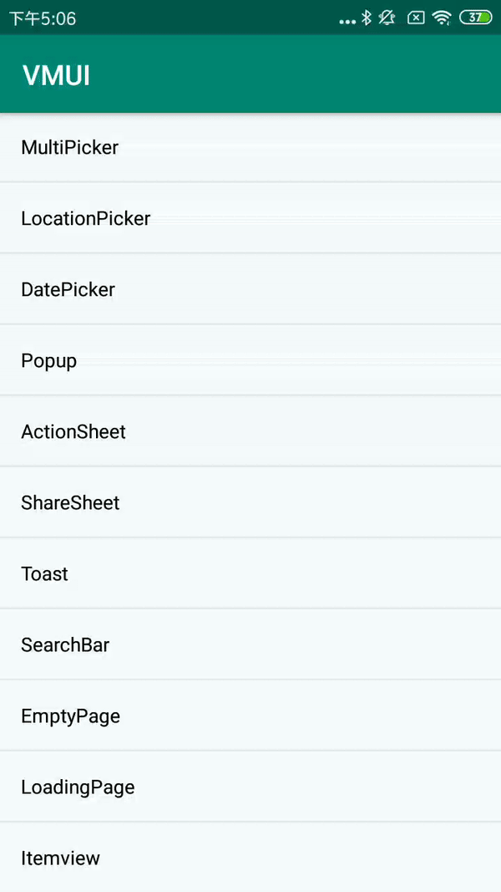

#### DatePickerBuilder扩展方法

| Name                     | Description                                     |
| ------------------------ | ----------------------------------------------- |
| setBeginTimestamp        | 日期开始时间                                    |
| setEndTimestamp          | 日期结束时间                                    |
| getSelectTime            | 获取选中时间                                    |
| setShowDateFormatPattern | 展示日期格式类型 0：yyyy-MM-dd，1：MM-dd，2：dd |

#### 使用方法

```java
VDialog.DatePickerBuilder builder2 = new VDialog.DatePickerBuilder(MainActivity.this);
builder2.addAction("确认", new VDialogAction.ActionListener() {    
    @Override   
     public void onClick(Dialog dialog, int index) {
                 Toast.makeText(MainActivity.this, "您选择的内容是：" + builder2.getSelectTime(), Toast.LENGTH_SHORT).show(); 
                 dialog.dismiss();   
            }
        })        
.setShowDateFormatPattern(0)        
.setBeginTimestamp("2001-01-01")        
.setEndTimestamp("2029-05-01")       
 .setTitle("弹窗标题")        
.showDialog();
```

