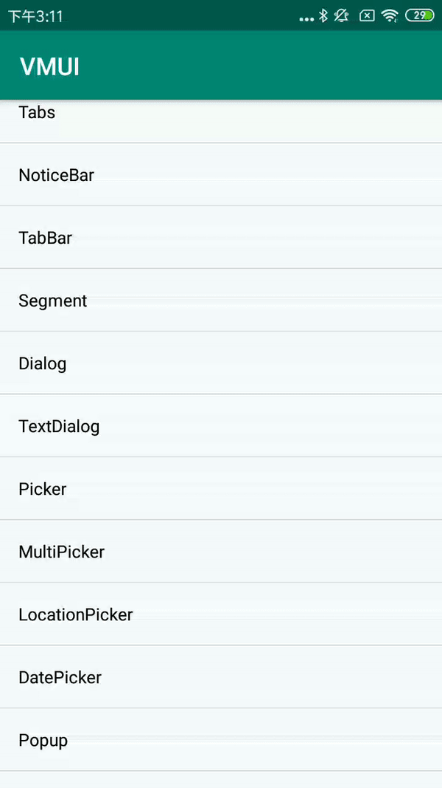

#### VDialogBuilder主要方法

| Name                      | Description                          |
| ------------------------- | ------------------------------------ |
| setTitle                  | 设置对话框顶部的标题文字             |
| setHeadImage              | 设置对话框顶部的图标资源             |
| setCancelable             | 是否可以取消                         |
| setCanceledOnTouchOutside | 是否点击外部可以取消                 |
| hasTitle                  | 判断对话框是否需要显示title          |
| hasHeadImage              | 判断对话框是否需要显示顶部的图标资源 |
| addAction                 | 添加对话框底部的操作按钮             |
| showDialog                | 产生一个 Dialog 并显示出来           |
| showActionSheet           | 产生一个 ActionSheet 并显示出来      |
| showPopup                 | 产生一个 Popup并显示出来             |

####  MessageDialogBuilder新增方法

| Name       | Description          |
| ---------- | -------------------- |
| setMessage | 设置对话框的消息文本 |


#### 使用方法

```java
new VDialog
.MessageDialogBuilder(MainActivity.this)
.addAction("确认", new VDialogAction.ActionListener() {
    @Override
    public void onClick(Dialog dialog, int index) {
        dialog.dismiss();  
        } 
    })  
.setHeadImage(R.mipmap.ic_launcher)
.setTitle("弹窗标题")
.setMessage("弹窗内容，告知当前状态、信息和解决方法，联系电话：18888888888")
.showDialog();
```

