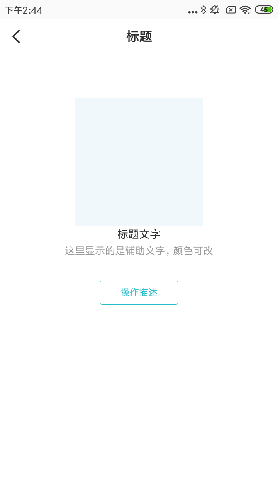

#### VEmptyPage主要属性

| Name                     | Type      | Description    |
| ------------------------ | --------- | -------------- |
| empty_loading            | boolean   | 是否是加载中   |
| empty_process            | integer   | 加载进度       |
| empty_img                | reference | 空页面图片     |
| empty_title              | string    | 标题           |
| empty_title_textcolor    | color     | 标题字体颜色   |
| empty_title_textsize     | dimension | 标题字体大小   |
| empty_subtitle           | string    | 副标题         |
| empty_subtitle_textcolor | color     | 副标题字体颜色 |
| empty_subtitle_textsize  | dimension | 副标题字体大小 |
| empty_button             | string    | 按钮文字       |

#### 使用方法

```xml
<com.viomi.vmui.VEmptyPage    
 android:layout_width="match_parent"
 android:layout_height="match_parent"    
 app:empty_img="@drawable/empty_drawable"    
 app:empty_button="操作描述"    
 app:empty_subtitle="这里显示的是辅助文字，颜色可改"
 app:empty_title="标题文字" />
```

