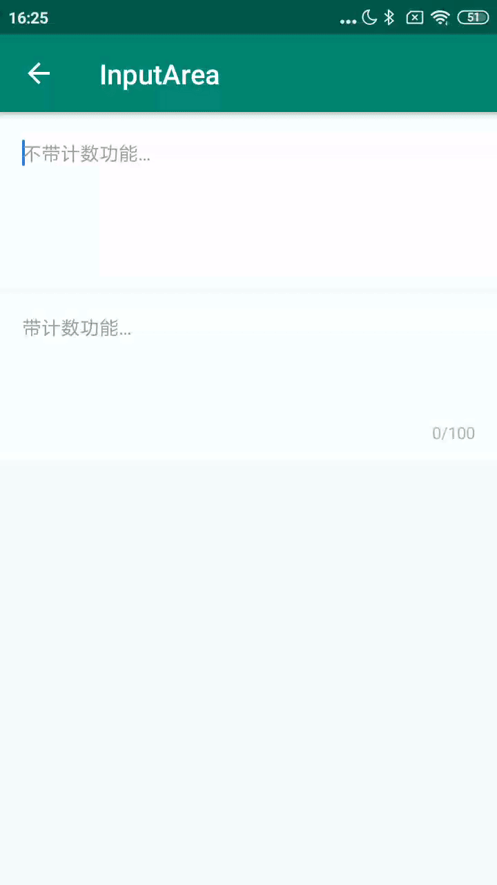

#### 主要属性

| Name       | Type    | Description  |
| ---------- | ------- | ------------ |
| hint_text  | string  | 提示         |
| max_count  | integer | 最大输入数   |
| show_count | boolean | 是否显示计数 |

#### 使用方法

##### 不显示计数

```xml
 <com.viomi.vmui.VInputTextArea
        android:layout_width="match_parent"
        android:layout_height="wrap_content"
        android:layout_gravity="bottom"
        android:layout_marginTop="6dp"
        app:hint_text="不带计数功能…"
        app:show_count="false" />
```

##### 显示计数

```xml
 <com.viomi.vmui.VInputTextArea
        android:layout_width="match_parent"
        android:layout_height="wrap_content"
        android:layout_gravity="bottom"
        android:layout_marginTop="6dp"
        app:hint_text="带计数功能…" />
```

