#### 主要属性

| Name                         | Type      | Description                                                  |
| ---------------------------- | --------- | ------------------------------------------------------------ |
| item_style                   | enum      | item样式,["normal","small_icon_left","small_icon_right"<br />,"middle_icon_left","middle_icon_right","big_icon_left"<br />,"big_icon_right","select","radio_check","switch_style","button","row_title"] |
| item_lefttitle               | string    | 左标题                                                       |
| item_lefttitle_textsize      | dimension | 左标题字体大小                                               |
| item_lefttitle_textcolor     | color     | 左标题字体颜色                                               |
| item_sublefttitle            | string    | 左副标题                                                     |
| item_sublefttitle_textsize   | dimension | 左副标题字体大小                                             |
| item_sublefttitle_textcolor  | color     | 左副标题字体颜色                                             |
| item_righttitle              | string    | 右标题                                                       |
| item_righttitle_textsize     | dimension | 右标题字体大小                                               |
| item_righttitle_textcolor    | color     | 右标题字体颜色                                               |
| item_subrighttitle           | string    | 右副标题                                                     |
| item_subrighttitle_textsize  | dimension | 右副标题字体大小                                             |
| item_subrighttitle_textcolor | color     | 右副标题字体颜色                                             |
| item_button                  | string    | 按钮文字                                                     |
| item_text_redot              | boolean   | 显示标题红点                                                 |
| item_img_redot               | boolean   | 显示标题右边图标红点                                         |
| item_src                     | reference | 标题图标                                                     |
| item_select                  | boolean   | 是否已选择                                                   |
| item_check                   | boolean   | 是否已选中                                                   |
| item_switch_check            | boolean   | switch开关是否已打开                                         |
| item_arrow                   | boolean   | 是否显示右边箭头                                             |
| item_arrow_src               | reference | 右边箭头图标                                                 |

### 使用方法

#### “normal”普通样式

```xml
<com.viomi.vmui.VItemView
   android:layout_width="match_parent"
   android:layout_height="wrap_content"
   app:item_lefttitle="左标题"
   app:item_righttitle="强调"
   app:item_righttitle_textcolor="@color/tips_gray|@color/text_red|@color/smoke_gray"
   app:item_text_redot="true|false" 
   app:item_style="normal" />
```

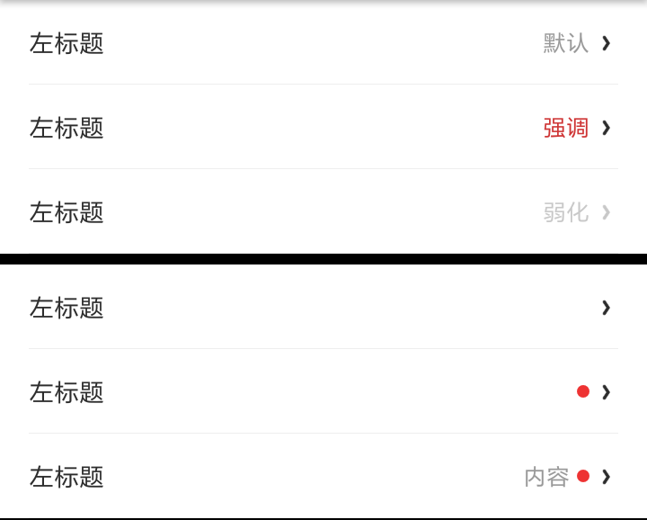

```xml
 <com.viomi.vmui.VItemView
   android:layout_width="match_parent"
   android:layout_height="wrap_content"
   app:item_lefttitle="我们希望打破设计师与工程师的隔阂，让大家我们希望打破设计师与工程师的隔阂，让大家"
   app:item_lefttitle_textcolor="@color/title_gray"
   app:item_style="normal"
   app:item_sublefttitle="每个设计师、工程师都有自己的习惯、美学倾每个设计师、工程师都有自己的习惯、美学倾"
   />
```
   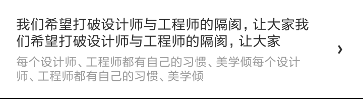
```xml
     <com.viomi.vmui.VItemView
      android:layout_width="match_parent"
      android:layout_height="wrap_content"
      app:item_lefttitle="左标题"
      app:item_righttitle="右标题"
      app:item_righttitle_textcolor="@color/title_gray"
      app:item_style="normal"
      app:item_arrow="true|false"
      app:item_sublefttitle="左辅助文字"
      app:item_subrighttitle="右辅助文字" />
```
 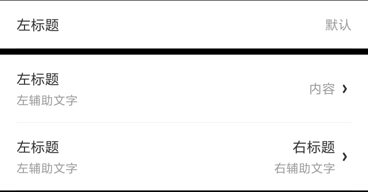

#### 左边带图标样式

```xml
<com.viomi.vmui.VItemView
   android:layout_width="match_parent"
   android:layout_height="wrap_content"
   app:item_lefttitle="左标题"
   app:item_righttitle="右标题"
   app:item_righttitle_textcolor="@color/title_gray"
   app:item_src="@mipmap/img_2"
   app:item_style="small_icon_left|middle_icon_left|big_icon_left"
   app:item_sublefttitle="左辅助文字"
   app:item_subrighttitle="右辅助文字" />
```
 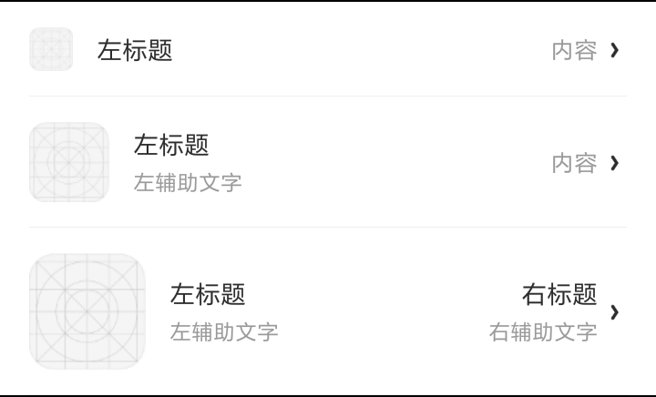

#### 右边边带图标样式

 ```xml
  <com.viomi.vmui.VItemView
   android:layout_width="match_parent"
   android:layout_height="wrap_content"
   app:item_lefttitle="左标题"
   app:item_src="@mipmap/img_2"
   app:item_style="small_icon_right|middle_icon_right|big_icon_right"
   app:item_img_redot="true|false"
   app:item_sublefttitle="左辅助文字" />
 ```
 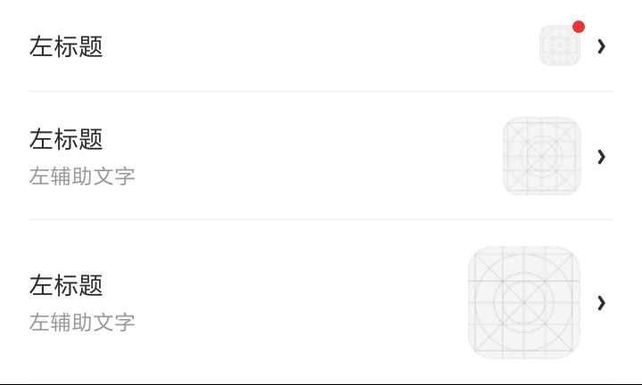

####  选择样式

  ```xml
  <com.viomi.vmui.VItemView
   android:layout_width="match_parent"
   android:layout_height="wrap_content"
   app:item_lefttitle="选择"
   app:item_select="true|false"
   app:item_style="select" />
  ```
  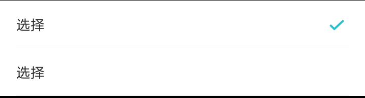

####  单选样式

```xml
 <com.viomi.vmui.VItemView
   android:layout_width="match_parent"
   android:layout_height="wrap_content"
   app:item_check="true|false"
   app:item_lefttitle="选择"
   app:item_style="radio_check" />
```
  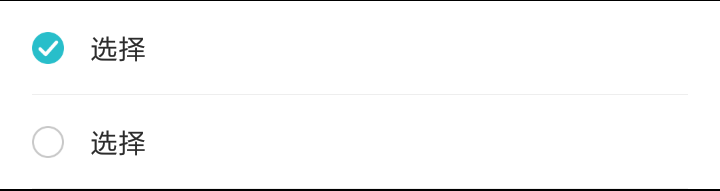

####  带Switch开关样式

```xml
 <com.viomi.vmui.VItemView
   android:layout_width="match_parent"
   android:layout_height="wrap_content"
   app:item_lefttitle="开关"
   app:item_switch_check="true|false"
   app:item_style="switch_style"/>
```
    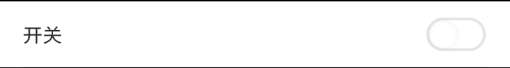
####  带按钮样式

 ```xml
 <com.viomi.vmui.VItemView
   android:layout_width="match_parent"
   android:layout_height="wrap_content"
   app:item_button="小按钮"
   app:item_lefttitle="左标题"
   app:item_style="button"/>
 ```
  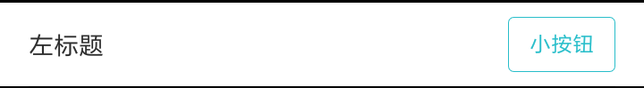

#### 标题样式

 ```xml
 <com.viomi.vmui.VItemView
   android:layout_width="match_parent"
   android:layout_height="wrap_content"
   app:item_lefttitle="小组标题"
   app:item_lefttitle_textcolor="@color/tips_gray"
   app:item_lefttitle_textsize="@dimen/item_rowtitle_textsize"
   app:item_style="row_title"/>
 ```
   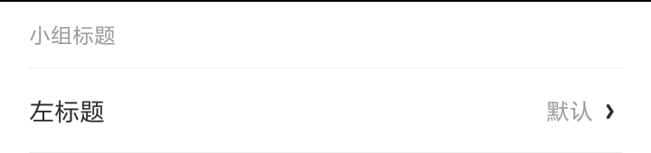

#### 删除样式
需在列表处理，控制itemview滚动
 ```java
 itemview.llRoot.scrollTo(x, 0);
 ```
 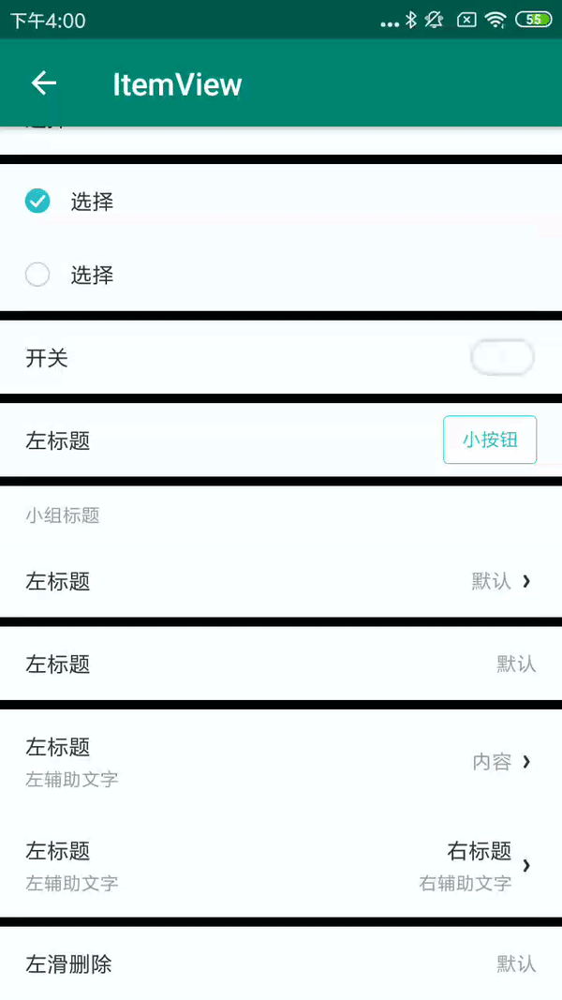