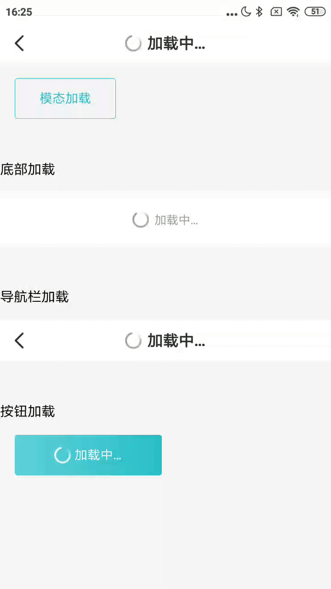

### 模态加载
```java
 VToast.makeLoadingToast(this, "正在加载...", Toast.LENGTH_SHORT).show();
```

#### 底部加载

```xml
 <com.viomi.vmui.VLoadingItem
        android:layout_width="match_parent"
        android:layout_height="wrap_content"
        android:layout_marginTop="16dp"
        app:loading_text="加载中…" />
```

#### 导航栏加载

```xml
 <com.viomi.vmui.VNavBar
        android:layout_width="match_parent"
        android:layout_height="wrap_content"
        android:layout_marginTop="16dp"
        app:nar_isloading="true"
        app:text_title="加载中…" />
```

#### 按钮加载

```xml
 <com.viomi.vmui.VButton
        android:layout_width="160dp"
        android:layout_height="@dimen/normal_btn_height"
        android:layout_marginLeft="16dp"
        android:layout_marginTop="16dp"
        app:button_style="green_fill"
        app:isloading="true"
        app:text_content="加载中…" />
```

