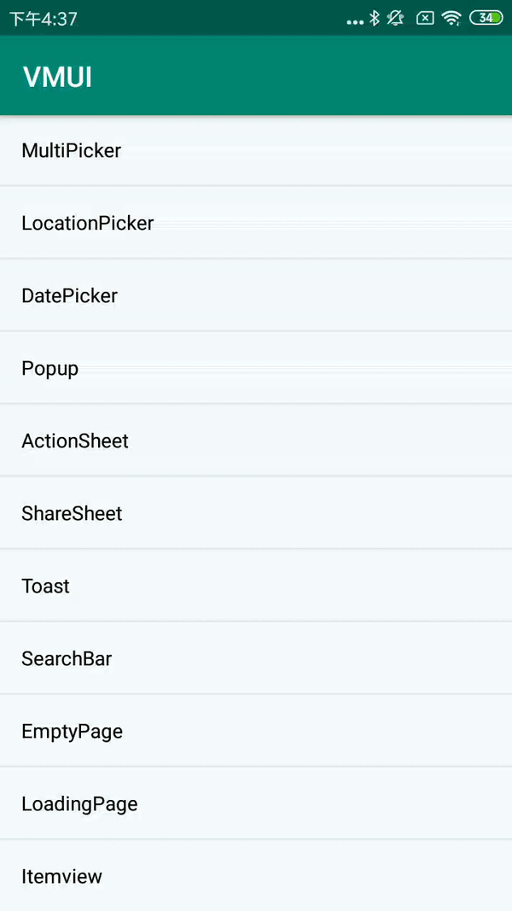

#### 使用方法


```java
VDialog.LocationPickerDialogBuilder builder3 = new VDialog.LocationPickerDialogBuilder(MainActivity.this);
builder3.addAction("确认", new VDialogAction.ActionListener() {  
      @Override    
      public void onClick(Dialog dialog, int index) {  
                Toast.makeText(MainActivity.this, "您选择的内容是：" + builder3.getSelectContent(), Toast.LENGTH_SHORT).show();      
                dialog.dismiss();  
            }
        })       
.setTitle("弹窗标题")       
.showDialog();
```

