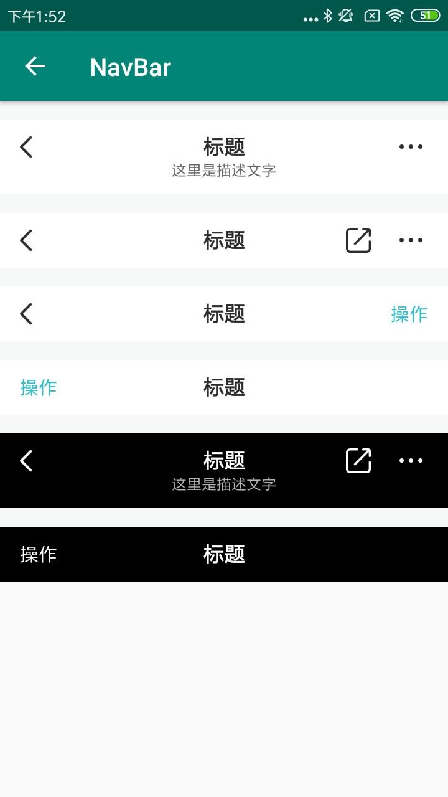

#### 使用示例：

```xml
<com.viomi.vmui.VNavBar       
android:layout_width="match_parent"    
android:layout_height="wrap_content"    
app:enable_right="true"   
app:text_subtitle="这里是描述文字"    
app:text_title="标题" />
```

#### 主要属性：

| Name                 | Type      | Description                              |
| -------------------- | --------- | ---------------------------------------- |
| title_style          | enum      | 主题样式["light",""dark""];缺省："light" |
| text_title           | string    | 主标题                                   |
| text_subtitle        | string    | 副标题                                   |
| text_back            | string    | 返回标题                                 |
| text_right           | string    | 右边标题                                 |
| title_drawable_back  | reference | 返回图标                                 |
| title_drawable_right | reference | 右边图标                                 |
| title_drawable_share | reference | 分享图标                                 |
| title_size           | dimension | 主标题文字大小                           |
| title_subtext_size   | dimension | 副标题文字大小                           |
| enable_back          | boolean   | 是否启用返回按钮                         |
| enable_right         | boolean   | 是否启用右边按钮                         |
| enable_share         | boolean   | 是否启用分享按钮                         |

#### 预览：

