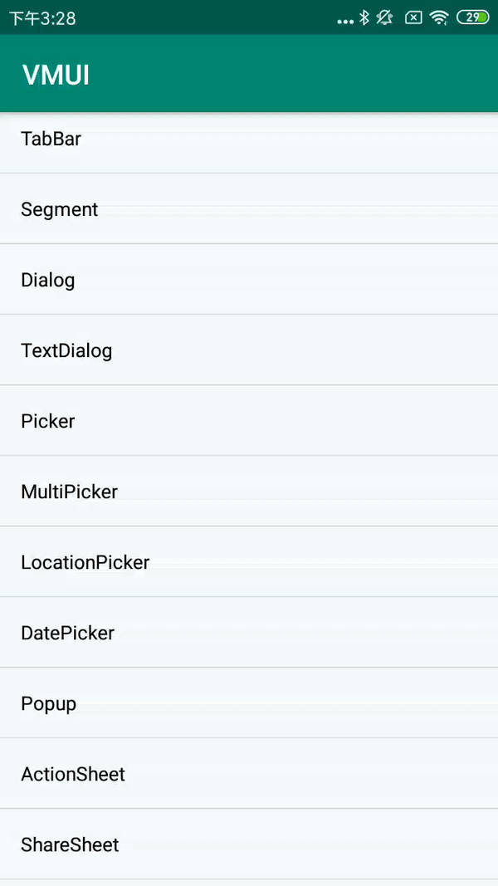

#### SingleCheckableDialogBuilder扩展方法

| Name        | Description    |
| ----------- | -------------- |
| setData     | 设置单选项数据 |
| getSelected | 获取选中项     |

#### 使用方法


```java
List<String> data = new ArrayList<>();
data.add("选项0");
data.add("选项1");
data.add("选项2");
data.add("选项3");
data.add("选项4");
data.add("选项5");
data.add("选项6");
VDialog.SingleCheckableDialogBuilder builder1 = new VDialog.SingleCheckableDialogBuilder(MainActivity.this);
builder1.addAction("确认", VDialogAction.ACTION_PROP_POSITIVE, new VDialogAction.ActionListener() {    
             @Override   
             public void onClick(Dialog dialog, int index) {
                Toast.makeText(MainActivity.this, "您选择的内容是：" + builder1.getSelected(), Toast.LENGTH_SHORT).show();        
                builder1.getPickerView().onDestroy(); 
                dialog.dismiss(); 
                }
         })       
.setTitle("弹窗标题")        
.setData(data)       
.showDialog();
```

