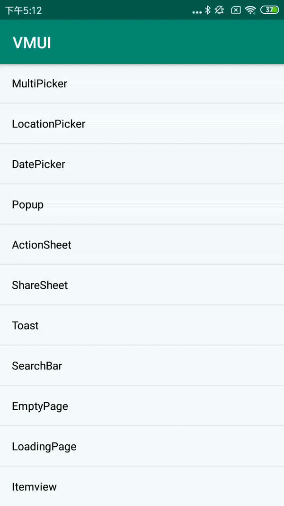

#### MultiButtonActionSheetBuilder扩展方法

| Name                        | Description           |
| --------------------------- | --------------------- |
| addItem                     | 添加item              |
| setOnSheetItemClickListener | 设置ItemClickListener |

#### 使用方法

```java
new VActionSheet.MultiButtonActionSheetBuilder(MainActivity.this)
        .setTitle("这是一个清晰的描述")        
        .addItem("按钮1")        
        .addItem("按钮2")        
        .addItem("按钮3")        
        .addAction("确认", VDialogAction.ACTION_PROP_POSITIVE, new VDialogAction.ActionListener() {
            @Override            
            public void onClick(Dialog dialog, int index) {                
                dialog.dismiss();            
                 }        
             })        
        .setOnSheetItemClickListener(new VActionSheet.MultiButtonActionSheetBuilder.OnSheetItemClickListener(
           {   
            @Override           
            public void onItemClick(Dialog dialog, String selected) {
                dialog.dismiss();                
                VToast.makeErrorText(MainActivity.this, "您按下的按钮是：" + selected, Toast.LENGTH_SHORT).show();            
              }        
           })       
        .showActionSheet();
```

