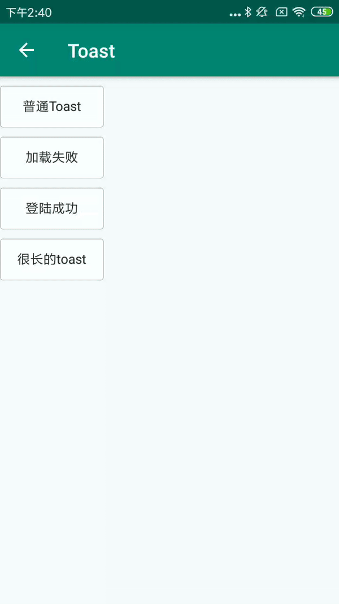

#### VToast的主要方法

| Name            | Description       |
| --------------- | ----------------- |
| makeText        | 创建Toast         |
| makeSuccessText | 创建成功提示Toast |
| makeErrorText   | 创建失败提示Toast |
| show            | 显示              |

#### 使用方法

```java
VToast.makeText(this,"这是一个Toast", Toast.LENGTH_SHORT).show();
VToast.makeSuccessText(this,"登陆成功",Toast.LENGTH_SHORT).show();
VToast.makeErrorText(this,"加载失败",Toast.LENGTH_SHORT).show();
VToast.makeText(this,"这是一个很长很长很长很长很长很长很长很长很长很长很长很长很长很长很长很长很长很长很长很长的Toast",Toast.LENGTH_SHORT).show();
```

